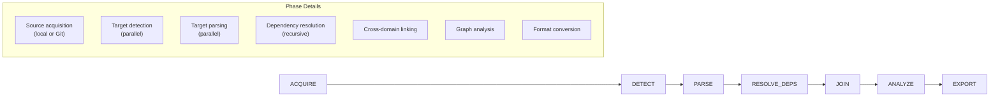
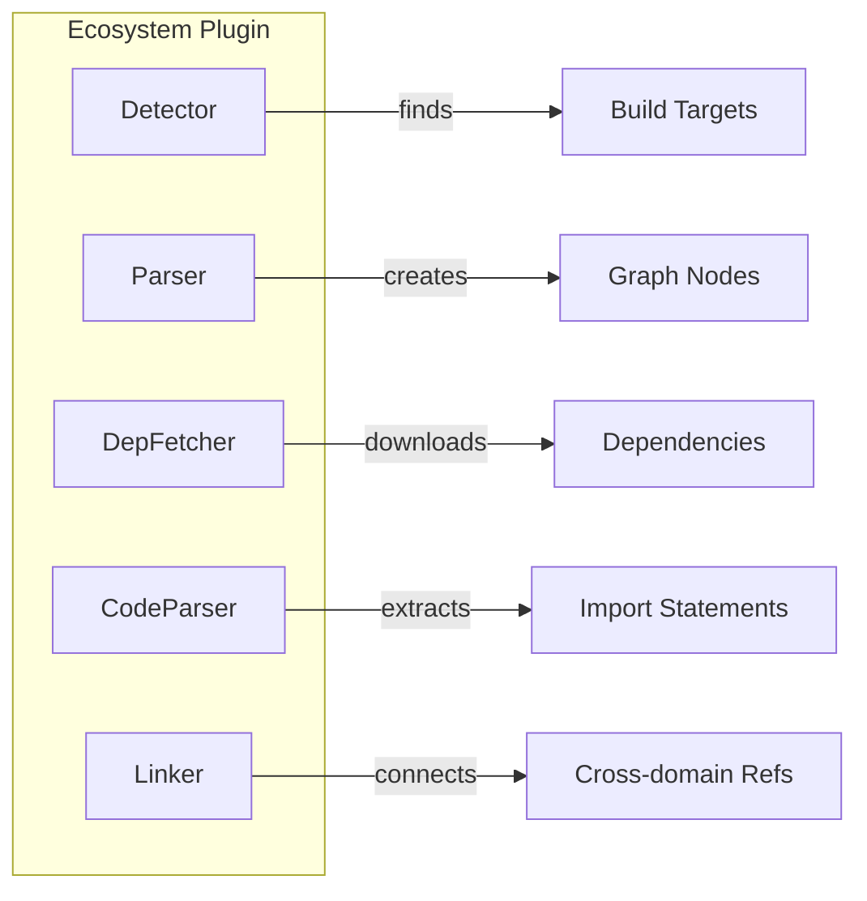

# Architecture & Design

This document explains Depanalyzer's system design: what we optimize for, the core philosophy, and how the runtime/graph/parsers fit together.

## Goals & Non-Goals

**Goals**

- Mixed-ecosystem dependency extraction (C/CMake, npm/TS, Maven/Java, Hvigor/ArkTS).
- Third-party dependency resolution as *separate* transactions (cacheable, retryable, parallelizable).
- A unified graph model that downstream tooling can consume (license, compliance, tracing, export).
- High throughput on large repos through concurrency and incremental caching.
- Graceful degradation: partial graphs are still useful.

**Non-Goals (by design)**

- Fully reproducing build systems (we extract dependency facts; we do not run builds).
- Perfect semantic resolution for every language construct (we prefer “known + evidence” over fragile guesses).

## Core Philosophy

Depanalyzer is built around a few invariants that drive the implementation:

1. **One scan = one transaction**  
   A scan runs as an isolated transaction (its own workspace + graph state). This keeps concurrency safe and makes failures easy to contain.

2. **Facts first, inference later**  
   Parsers/detectors report *facts* (targets found, declared deps, discovered includes/imports). Cross-domain wiring and heuristics are handled by linkers/policies so the “why” stays explicit.

3. **Unified “dependency construct graph”**  
   The transaction graph is a typed **directed multigraph** (not guaranteed acyclic). Cycles are expected (imports, mutual deps) and are handled via condensation/export utilities when a DAG is required.

4. **Graph-of-graphs for third-party**  
   Third-party resolution creates *additional graphs* (child transactions). A global package-level DAG tracks graph-to-graph dependencies; exports can merge them with stable namespacing.

5. **Performance is structural**  
   Detection is streaming and ignore-aware; execution is parallel; caches are first-class. No busy-wait polling in critical schedulers.

6. **Degrade gracefully**  
   Recoverable errors and placeholders allow progress; downstream phases (license/compliance) still get a complete-enough view.

## Lifecycle Pipeline

Depanalyzer processes projects through a 7-phase pipeline:



### Phase Descriptions

| Phase | Purpose | Key Operations |
|-------|---------|----------------|
| **ACQUIRE** | Obtain source code | Clone Git repos or validate local paths |
| **DETECT** | Find build targets | Scan for CMakeLists.txt, package.json, pom.xml, etc. |
| **PARSE** | Extract dependencies | Parse build configs, create graph nodes and edges |
| **RESOLVE_DEPS** | Fetch third-party deps | Download/clone external dependencies recursively |
| **JOIN** | Link cross-domain refs | Connect code files to modules, resolve imports |
| **ANALYZE** | Run analysis passes | Linkage analysis, dead code detection, uncertainty |
| **EXPORT** | Output results | Serialize graph snapshots (JSON) and derived views |

## Component Architecture

```mermaid
flowchart TB
    subgraph CLI["CLI Layer"]
        main[main.py]
        scan[scan command]
        export[export command]
    end

    subgraph Runtime["Runtime Layer"]
        tx[Transaction]
        orch[PhaseOrchestrator]
        phases[Phase Implementations]
        pools[Worker Pools]
    end

    subgraph Graph["Graph Layer"]
        gm[GraphManager]
        backend[GraphBackend]
        gr[GraphRegistry (SQLite)]
        dag[GlobalDAG (SQLite)]
        ops[Graph Ops]
    end

    subgraph Parsers["Parser Layer"]
        reg[EcosystemRegistry]
        cpp[C++ Parser]
        npm[npm Parser]
        hvigor[Hvigor Parser]
        maven[Maven Parser]
    end

    subgraph Events["Event System"]
        bus[EventBus]
    end

    main --> tx
    tx --> orch
    orch --> phases
    phases --> pools
    phases --> gm
    gm --> backend
    phases --> gr
    phases --> dag
    phases --> reg
    reg --> cpp & npm & hvigor & maven
    phases --> bus
```

### Core Components

#### Transaction & PhaseOrchestrator

The `Transaction` class provides a facade for running analysis. Internally, `PhaseOrchestrator` manages the 7-phase execution pipeline, instantiating each phase with shared `TransactionState`.

```
Transaction
    └── PhaseOrchestrator
            ├── AcquirePhase
            ├── DetectPhase
            ├── ParsePhase
            ├── ResolveDepsPhase
            ├── JoinPhase
            ├── AnalyzePhase
            └── ExportPhase
```

#### GraphManager & GraphRegistry

- **GraphManager**: Per-transaction instance managing nodes, edges, and metadata. Backed by a `GraphBackend` (default: `NetworkXBackend` using `networkx.MultiDiGraph`).
- **GraphRegistry**: Process-wide singleton that maps `graph_id -> cache_path + summary` using SQLite (WAL mode). Reconfigurable per scan cache root.
- **GlobalDAG**: Process-wide singleton that stores *graph-to-graph* dependencies (parent graph depends on child graphs) using SQLite (WAL mode).

#### EcosystemRegistry

Central registry for ecosystem plugins. Each ecosystem registers:
- **Detector** - Finds build configuration files
- **Parser** - Extracts dependencies from configs
- **DepFetcher** - Downloads external dependencies
- **CodeParser** - Parses source code imports (optional)
- **Linker** - Links cross-domain references (optional)

#### EventBus

Publish-subscribe system for cross-domain communication:

| Event Type | Description |
|------------|-------------|
| `TARGET_DETECTED` | Build target file found |
| `MODULE_DETECTED` | Module identified |
| `TARGET_PARSED` | Parsing completed |
| `DEPENDENCY_DISCOVERED` | New dependency found |
| `EXTERNAL_DEP_RESOLVED` | External dep fetched |

#### Worker Pools

Parallel execution infrastructure:
- **Worker** - Thread-pool based task queue with priority scheduling and notification (no busy-wait).
- **ProcessPool** - Multiprocess execution for CPU-heavy parsing (used by code parser pools).
- **CodeParserPool** - Specialized pool for source parsing (imports/includes).
- **DepFetchPool** - Dependency download workers (network/subprocess).

## Data Model

### Graph Type

The transaction graph is a **directed multigraph** where:

- Nodes are typed entities (file/module/target/artifact/etc).
- Edges are typed relationships and may appear multiple times between the same endpoints (with different evidence/attributes).
- Cycles may exist; condensation utilities can produce SCC cluster nodes when a DAG is required.

### Node Types

Node types are defined in `depanalyzer/graph/models/schema.py` and fall into a few categories:

| Category | Types (examples) |
|----------|------------------|
| **Core** | `code`, `config`, `module`, `artifact`, `external_dep`, `external_library`, `license`, `proxy`, `unknown` |
| **C/CMake** | `system_header`, `project_header`, `target`, `subdirectory`, `toolchain`, `build_config`, `shared_library`, `static_library`, `executable` |
| **Hvigor** | `hap`, `har`, `hsp` |
| **Analysis** | `scc_cluster`, `code_scc_cluster` |
| **Misc** | `process`, `asset` |

### Edge Types

Edge kinds are defined in `depanalyzer/graph/models/schema.py` as `EdgeKind` and stored as the `kind` attribute on backend edges.

| Edge Kind | Meaning (high level) |
|-----------|----------------------|
| `depends_on` | Declared dependency (build/package) |
| `include` | Header include relationship |
| `import` | Language import relationship |
| `sources` | Membership: module/target owns source files |
| `link_libraries` | Linking relationship between artifacts/targets |
| `contains` | Containment/grouping (e.g., workspace/module membership) |
| `defined_by` | Definition relationship (e.g., file defines target) |
| `include_dirs` | Include path relationship |
| `alias_of` | Alias relationship |
| `implements_native` | Cross-domain bridge (e.g., TS module implements native) |
| `consumes` / `produces` | Contract-like producer/consumer relationships |
| `links` / `part_of` / `affects` | Analysis/annotation edges |

### Graph Storage

- **In-memory (per transaction)**: `networkx.MultiDiGraph` via `NetworkXBackend`
- **Persistent metadata (cross transactions)**: SQLite (`GraphRegistry`, `GlobalDAG`) with WAL mode
- **Export formats**: JSON (node-link), plus derived views (e.g., asset→artifact mapping)

### Stable IDs & Namespacing

- Project-local path-like nodes use canonical IDs like `//src/main.cpp` (normalized relative to the transaction root).
- External/package nodes commonly use an explicit namespace such as `//external:npm/<name>`.
- When exporting a merged graph for third-party resolution, dependency graph nodes are prefixed to avoid collisions: `//dep/<namespace>/...`.

## Ecosystem Plugin System

Each ecosystem implements a standard set of components:



### Supported Ecosystems

| Ecosystem | Detector Target | Parser Output |
|-----------|-----------------|---------------|
| **C++** | CMakeLists.txt | cmake_target, library, executable |
| **npm** | package.json | npm_package, workspace |
| **Hvigor** | build-profile.json5 | hap, hsp, har |
| **Maven** | pom.xml | maven_artifact |

## Error Handling

Depanalyzer uses a recoverable error hierarchy for graceful degradation:

| Exception | Cause | Recovery |
|-----------|-------|----------|
| `ConfigurationError` | Malformed config file | Skip target, continue |
| `ParseError` | Source parsing failure | Mark as unparsed |
| `FetchError` | Dependency download failed | Use placeholder node |
| `DetectionError` | Target detection failed | Log and continue |

This allows the pipeline to produce partial results even when some files or dependencies fail to process.

## Caching Layout (CLI default)

The `scan` command defaults to a per-project cache layout under `.dep_cache`:

```
.dep_cache/
  <source_stem>/
    sources/               # acquired sources and fetched dependencies
      workspaces/          # per-dependency workspaces
    graphs/                # exported graph snapshots and registries
      registry.db          # GraphRegistry (SQLite)
      global_dag.db        # GlobalDAG (SQLite)
      <graph_id>.json      # per-transaction graph
      <graph_id>.licenses.json   # per-graph ScanCode cache (scancode cmd)
```

The global DAG write-time cycle check can be disabled via `DEPANALYZER_DAG_CHECK_ON_WRITE=0` for extremely large dependency DAGs.

## Extension Points

Depanalyzer provides several extension mechanisms:

1. **New Ecosystems** - Register detector, parser, fetcher via `EcosystemRegistry`
2. **Lifecycle Hooks** - Add `before()` and `after()` logic to any phase
3. **Custom Analyzers** - Implement analysis passes on the graph
4. **Graph Operations** - Add custom transformations (merge, projection, etc.)
5. **Contract System** - Define cross-language linking rules

See [Extension Guide](extension-guide.md) for implementation details.
