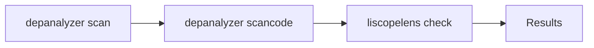

# Scripts Reference

Documentation for helper scripts included with Depanalyzer.

## Overview

| Script | Purpose |
|--------|---------|
| `run_license_compatibility.py` | Full license compliance pipeline |
| `graph_explorer_tui.py` | Interactive graph visualization |
| `interactive_graph_explorer.py` | Lightweight interactive CLI graph explorer |
| `test.py` | Developer scratchpad for liscopelens |

---

## License Compliance Pipeline

**Script:** `scripts/run_license_compatibility.py`

Automates the complete license compliance workflow: scan → license detection → compatibility check.

### Workflow



1. **Scan** - Generate dependency graph with `depanalyzer scan`
2. **ScanCode** - Detect licenses with `depanalyzer scancode`
3. **Liscopelens** - Check license compatibility

### Requirements

- Depanalyzer installed
- ScanCode Toolkit (auto-installed or manual)
- Liscopelens (`pip install liscopelens`)

### Usage

```bash
python scripts/run_license_compatibility.py [options]
```

Notes:

- When no project selection flags are provided, the script falls back to a workspace-specific default path. In practice, always pass `--project-path`, `--projects-file`, or `--projects-dir`.
- `--timeout` is forwarded to `depanalyzer scan --timeout` (currently reserved for future global timeout enforcement and unused by `scan`; task-level timeouts still apply).

### Arguments

#### Project Selection

| Option | Type | Description |
|--------|------|-------------|
| `--project-path` | path | Repository to analyze (repeatable) |
| `--projects-file` | path | File with newline-separated project paths |
| `--projects-dir` | path | Directory containing multiple projects (repeatable) |

#### Output Configuration

| Option | Type | Default | Description |
|--------|------|---------|-------------|
| `--output-dir` | path | `license_pipeline_output` | Base output directory |
| `--cache-dir` | path | `.dep_cache` | Cache directory for scan data |

#### Scan Options

| Option | Type | Default | Description |
|--------|------|---------|-------------|
| `--workers` | int | 8 | Worker count for scanning |
| `--max-depth` | int | 3 | Third-party dependency depth |
| `--max-deps` | int | - | Global dependency limit |
| `--timeout` | int | 900 | Forwarded to `depanalyzer scan --timeout` (currently unused by `scan`) |
| `-t, --third-party` | flag | false | Enable third-party resolution |
| `--disable-fallback-tree` | flag | false | Disable fallback tree |

#### Liscopelens Options

| Option | Type | Default | Description |
|--------|------|---------|-------------|
| `--liscopelens-path` | path | `/mnt/c/Workspace/liscopelens` | Path to liscopelens source (used when not installed) |
| `--liscopelens-config` | path | - | Custom liscopelens config (TOML/JSON) |
| `--shadow-file` | path | - | Shadow.json for license overrides (repeatable) |
| `--shadow-dir` | path | - | Directory with per-project shadow files (`<dir>/<project>.json` or `<dir>/<project>/shadow.json`) |

Notes:

- A single `--shadow-file` applies to all projects; multiple values are matched to projects in the order the projects are processed.
- `--shadow-dir` is used only when no `--shadow-file` values are provided.

#### Control Options

| Option | Type | Description |
|--------|------|-------------|
| `--force` | flag | Re-run all projects even if completed |
| `--force-scancode` | flag | Re-run ScanCode even if cached |
| `-v, --verbose` | flag | Enable debug logging |

### Examples

#### Single Project

```bash
python scripts/run_license_compatibility.py \
  --project-path /path/to/project \
  --output-dir ./results \
  --third-party
```

#### Multiple Projects (Flags)

```bash
python scripts/run_license_compatibility.py \
  --project-path /path/to/project1 \
  --project-path /path/to/project2 \
  --project-path /path/to/project3 \
  --output-dir ./results \
  --third-party
```

#### Multiple Projects (File)

```bash
# Create projects list
cat > projects.txt << EOF
/path/to/project1
/path/to/project2
/path/to/project3
EOF

# Run pipeline
python scripts/run_license_compatibility.py \
  --projects-file projects.txt \
  --output-dir ./results \
  --third-party
```

#### Batch from Directory

```bash
# Scan all subdirectories under /projects
python scripts/run_license_compatibility.py \
  --projects-dir /path/to/projects \
  --output-dir ./results \
  --third-party \
  --workers 16
```

#### With Shadow Files

```bash
# Single shadow for all projects
python scripts/run_license_compatibility.py \
  --project-path /path/to/project \
  --shadow-file /path/to/shadow.json

# Per-project shadows
python scripts/run_license_compatibility.py \
  --project-path /path/to/project1 --shadow-file /shadows/p1.json \
  --project-path /path/to/project2 --shadow-file /shadows/p2.json

# Shadow directory (expects `<dir>/<project_name>.json` or `<dir>/<project_name>/shadow.json`)
python scripts/run_license_compatibility.py \
  --projects-dir /path/to/projects \
  --shadow-dir /path/to/shadows
```

#### Custom Liscopelens Config

```bash
python scripts/run_license_compatibility.py \
  --project-path /path/to/project \
  --liscopelens-config /path/to/config.toml
```

### Output Structure

#### Single Project

```
output/
├── graph.json                  # Dependency graph
├── license_map.json            # License detection results
├── compatibility_results.json  # Compatibility check results
└── compatibility_graph.json    # Visualizable compliance graph
```

#### Batch Mode

```
output/
├── 01_project_name1/
│   ├── graph.json
│   ├── license_map.json
│   ├── compatibility_results.json
│   └── compatibility_graph.json
├── 02_project_name2/
│   ├── graph.json
│   ├── license_map.json
│   ├── compatibility_results.json
│   └── compatibility_graph.json
└── batch_summary.json          # Summary of all projects
```

### Default Liscopelens Configuration

The script uses a built-in configuration optimized for dependency analysis:

```python
{
    "blacklist": [],
    "license_isolations": [],
    "permissive_spreads": ["COMPILE", "STATIC_LINKING"],
    "edge_isolations": [],
    "edge_permissive_spreads": ["STATIC_LINKING"],
    "default_edge_behavior": "inherit",
    "edge_literal_mapping": {
        "depends_on": "DEPENDENCY",
        "dependency": "DEPENDENCY",
        "include": "INCLUDE",
        "import": "COMPILE",
        "sources": "COMPILE",
        "link_libraries": "STATIC_LINKING",
        "links": "STATIC_LINKING",
        "link": "STATIC_LINKING",
        "dynamic_link": "DYNAMIC_LINKING",
        "compile_depend": "COMPILE",
        "runtime_depend": "RUNTIME"
    },
    "literal_mapping": {
        "code": "COMPILE",
        "header": "COMPILE",
        "module": "COMPILE",
        "target": "COMPILE",
        "artifact": "COMPILE",
        "shared_library": "DYNAMIC_LINKING",
        "static_library": "STATIC_LINKING",
        "executable": "COMPILE",
        ...
    }
}
```

### Environment Variables

The pipeline inherits your environment. The most relevant variables are:

- `SCANCODE_BIN` / `SCANCODE_CLI`: Explicit path to the ScanCode executable.
- `SCANCODE_TOOLKIT`: Path to a ScanCode toolkit directory (fallback).
- `SCANCODE_VERSION`, `SCANCODE_BASE_URL`, `SCANCODE_DOWNLOAD_URL`: Affect `depanalyzer --install` downloads.
- `DEPANALYZER_DAG_CHECK_ON_WRITE=0`: Disable GlobalDAG cycle checks during writes (useful for very large dependency DAGs).

### Advanced Scan Configuration

`scripts/run_license_compatibility.py` forwards only a subset of `scan` flags. For full control of GraphBuildConfig (`--config`), run `depanalyzer scan ... --config ...` manually and then run `depanalyzer scancode` + liscopelens on the produced outputs.

---

## Graph Explorer TUI

**Script:** `scripts/graph_explorer_tui.py`

Interactive terminal UI for exploring dependency graphs.

### Features

- Search nodes by ID, label, or name
- Trace paths between two nodes
- Find common ancestors
- View detailed node information

### Usage

```bash
python scripts/graph_explorer_tui.py <graph.json>
```

### Interface

```
┌─────────────────────────────────────────────────────────────┐
│ Start Node: [Click to select Node A]                        │
│ End Node:   [Click to select Node B]                        │
│ [Trace Path]                                                │
├─────────────────────────────────────────────────────────────┤
│ Path Results          │ Node Details                        │
│ ├── node1             │ {                                   │
│ │   └── node2         │   "id": "//src/main.cpp",           │
│ │       └── node3     │   "type": "code",                   │
│ └── ...               │   "label": "main.cpp"               │
│                       │ }                                   │
└─────────────────────────────────────────────────────────────┘
```

### Workflow

1. **Load Graph** - Pass graph.json as argument
2. **Select Nodes** - Click buttons to search and select start/end nodes
3. **Trace Path** - Click "Trace Path" to find connections
4. **Explore Results** - Click nodes in the tree to view details

### Path Finding

The explorer finds connections in two ways:

1. **Direct Path** - Shortest path from A to B (or B to A)
2. **Common Ancestor** - If no direct path exists, finds the lowest common ancestor and shows paths from ancestor to both nodes

### Node Search

The search dialog supports:
- Node ID (e.g., `//src/main.cpp`)
- Label (e.g., `main.cpp`)
- Name attribute

Results are limited to 100 matches for performance.

### Example Session

```bash
# Generate a graph
depanalyzer scan ./my-project -o graph.json

# Explore the graph
python scripts/graph_explorer_tui.py graph.json

# In the TUI:
# 1. Click "Click to select Node A"
# 2. Search for "main.cpp" and select it
# 3. Click "Click to select Node B"
# 4. Search for "utils.h" and select it
# 5. Click "Trace Path"
# 6. View the dependency path in the tree
# 7. Click nodes to see their details
```

---

## Interactive Graph Explorer (CLI)

**Script:** `scripts/interactive_graph_explorer.py`

A lightweight, `rich`-based interactive explorer for JSON graphs. This is useful when you want a quick “path/info” workflow without the Textual UI.

### Usage

```bash
python scripts/interactive_graph_explorer.py <result_path>
```

`<result_path>` can be either:

- A JSON file (e.g., `graph.json` or `compatibility_graph.json`)
- A results directory (it will try `compatibility_graph.json` by default)

### Commands

- `info <query>`: search and show a node’s raw JSON record
- `path <query1> <query2>`: find and render a shortest path (or a common ancestor split view)
- `help`, `quit` / `exit`

---

## Developer Scratchpad (liscopelens)

**Script:** `scripts/test.py`

This script is a small developer helper for running `liscopelens.api.check_compatibility` directly. It is not part of the supported user workflow.

### Usage

```bash
python scripts/test.py <license_map.json> <graph.json>
```

It writes `res.json` (compatibility results) and `./scripts/test.json` (graph snapshot) in the current working directory.

---

## Docker Usage

### Building the Image

```bash
docker build -t depanalyzer .
```

### Single Project Analysis

```bash
docker run --rm \
  -v /path/to/project:/workspace/project \
  -v $(pwd)/output:/workspace/output \
  depanalyzer --project-path /workspace/project
```

### With Third-Party Dependencies

```bash
docker run --rm \
  -v /path/to/project:/workspace/project \
  -v $(pwd)/output:/workspace/output \
  depanalyzer --project-path /workspace/project --third-party
```

### Batch Analysis

```bash
# Create projects list
echo "/workspace/project1" > projects.txt
echo "/workspace/project2" >> projects.txt

# Run batch
docker run --rm \
  -v /path/to/p1:/workspace/project1 \
  -v /path/to/p2:/workspace/project2 \
  -v $(pwd)/projects.txt:/workspace/projects.txt \
  -v $(pwd)/output:/workspace/output \
  depanalyzer --projects-file /workspace/projects.txt
```

### Custom Configuration

```bash
docker run --rm \
  -v /path/to/project:/workspace/project \
  -v /path/to/config.toml:/workspace/config.toml \
  -v $(pwd)/output:/workspace/output \
  depanalyzer \
    --project-path /workspace/project \
    --liscopelens-config /workspace/config.toml
```

### Volume Mounts

| Host Path | Container Path | Purpose |
|-----------|----------------|---------|
| Project directory | `/workspace/project` | Source code to analyze |
| Output directory | `/workspace/output` | Results output |
| Config file | `/workspace/config.toml` | Custom configuration |
| Projects list | `/workspace/projects.txt` | Batch project list |

---

## Troubleshooting

### "liscopelens not found"

Install liscopelens or provide the source path:

```bash
pip install liscopelens

# Or point to source
python scripts/run_license_compatibility.py \
  --liscopelens-path /path/to/liscopelens \
  ...
```

### "ScanCode not found"

Install ScanCode:

```bash
depanalyzer --install
```

### Slow batch processing

Increase workers and consider skipping completed projects:

```bash
python scripts/run_license_compatibility.py \
  --projects-dir /path/to/projects \
  --workers 16 \
  --output-dir ./results
  # Completed projects are automatically skipped
```

### Force re-run

```bash
# Re-run everything
python scripts/run_license_compatibility.py \
  --project-path /path/to/project \
  --force

# Re-run only ScanCode
python scripts/run_license_compatibility.py \
  --project-path /path/to/project \
  --force-scancode
```
